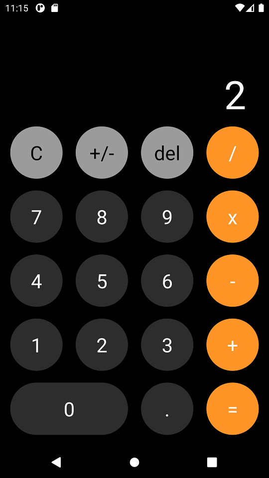

# Desarrollo de un APP de Calculadora IOS


## Inicio de Programa


## Operación resta 5-3
 

## Resultado operación resta
 


## Dependencias del proyecto

```bash
# Creación proyecto con template TS
npx react-native init calculadora --template react-native-template-typescript
# Ejecución Proyecto en Emulador Android
npx react-native run-android
```

## Codigos GIT

```bash
# Revisar logs
git log --pretty=oneline
#Cargar cambios y versiones
git branch -M main
git push -u origin main
# Generar Tags
           (Version) 
git tag -a V1.0.0 -m "Mensaje"
git push --tags
#branches (Ramas)
git add .
git checkout -b room
git commit -m "Agregado de dependencias"
git push origin room
#Unir Ramas a main
git checkout main
git merge <Nombre Rama> -m "Mensaje rama"
```